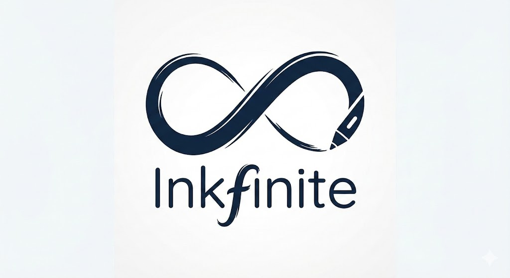

# InkFinite

A modern, premium infinite canvas application built for visual thinkers. Create, organize, and connect ideas on a boundless whiteboard using rich text notes, images, and spatial organization.


*(Note: Add a screenshot of the app here later)*

## 🚀 Features

*   **Infinite Workspace**: A boundless canvas powered by `tldraw` to map out your thoughts without limits.
*   **Markdown Notes**: Create rich text cards using standard Markdown syntax. Double-click to edit, click away to view.
*   **Multimedia Support**: Drag and drop images directly onto the canvas to create mood boards or references.
*   **Premium UI**: A sleek, dark-themed interface with glassmorphism effects and smooth animations.
*   **Local Persistence**: Your work is automatically saved to your browser's local storage.
*   **Export Options**: Export your entire canvas or selections as PNG images or JSON backups.

## 🛠️ Tech Stack

*   **Framework**: [Next.js 16](https://nextjs.org/) (App Router)
*   **Language**: TypeScript
*   **Canvas Engine**: [tldraw](https://tldraw.com/)
*   **Styling**: Tailwind CSS v4
*   **Markdown**: `react-markdown`

## 🏁 Getting Started

Follow these steps to set up the project locally.

### Prerequisites

*   Node.js 18.17 or later
*   npm, yarn, pnpm, or bun

### Installation

1.  **Clone the repository**:
    ```bash
    git clone https://github.com/rtango5301/AI-Note-Taker.git
    cd infinite-canvas
    ```

2.  **Install dependencies**:
    ```bash
    npm install
    # or
    yarn install
    ```

3.  **Run the development server**:
    ```bash
    npm run dev
    ```

4.  **Open the app**:
    Navigate to [http://localhost:3000](http://localhost:3000) in your browser.

### Development vs Production

**Development Mode** (Hot Reloading, Debugging):
```bash
npm run dev
```

**Production Mode** (Optimized, High Performance):
```bash
# 1. Build the application
npm run build

# 2. Start the production server
npm run start
```

## 📁 Project Structure

```bash
src/
├── app/                  # Next.js App Router pages
│   ├── page.tsx          # Main entry point
│   └── globals.css       # Global styles & theme variables
├── components/
│   ├── Editor.tsx        # Main canvas wrapper component
│   ├── CustomToolbar.tsx # Floating toolbar for actions
│   ├── MarkdownCardUtil.tsx # Custom shape logic for notes
│   └── Notification.tsx  # Toast notification system
```

### Deployment (Vercel)

The easiest way to deploy is to use the **Vercel Platform**.

1.  **Push to GitHub**: Ensure your project is pushed to a GitHub repository.
2.  **Import in Vercel**:
    *   Go to [Vercel Dashboard](https://vercel.com/dashboard).
    *   Click **"Add New..."** -> **"Project"**.
    *   Find your repo (`InkFinite`) and click **Import**.
3.  **Configure**:
    *   Framework Preset: `Next.js` (Auto-detected).
    *   Environment Variables: Add any if needed (none for base features).
    *   Click **Deploy**.

#### CI/CD Pipeline
This project is configured for **Zero-Config CI/CD** with Vercel:
*   **Preview Deployments**: Every time you push to a branch or open a Pull Request, Vercel automatically deploys a preview URL.
*   **Production Deployment**: When a PR is merged to `main`, Vercel automatically deploys to production.

We also included a **GitHub Action** (`.github/workflows/ci.yml`) that runs `lint` and `build` checks on every PR to ensure code quality before merging.

## 📚 Learning Resources

If you want to learn more about the technologies used in this project, check out these resources:

*   **Next.js**: [Official Documentation](https://nextjs.org/docs) - The best place to start with the App Router.
*   **Tldraw**: [Developer Docs](https://tldraw.dev/) - Learn how to customize the canvas and create custom shapes.
*   **React**: [React.dev](https://react.dev/) - Modern React patterns and hooks.
*   **Tailwind CSS**: [Tailwind Docs](https://tailwindcss.com/docs) - Utility-first CSS framework guide.
*   **TypeScript**: [TypeScript Handbook](https://www.typescriptlang.org/docs/) - Essential for strict type safety.

## 🤝 Contributing

Contributions are welcome! Please fork the repository and submit a pull request for any enhancements or bug fixes.

## 📄 License

This project is open-source and available under the [MIT License](LICENSE).
